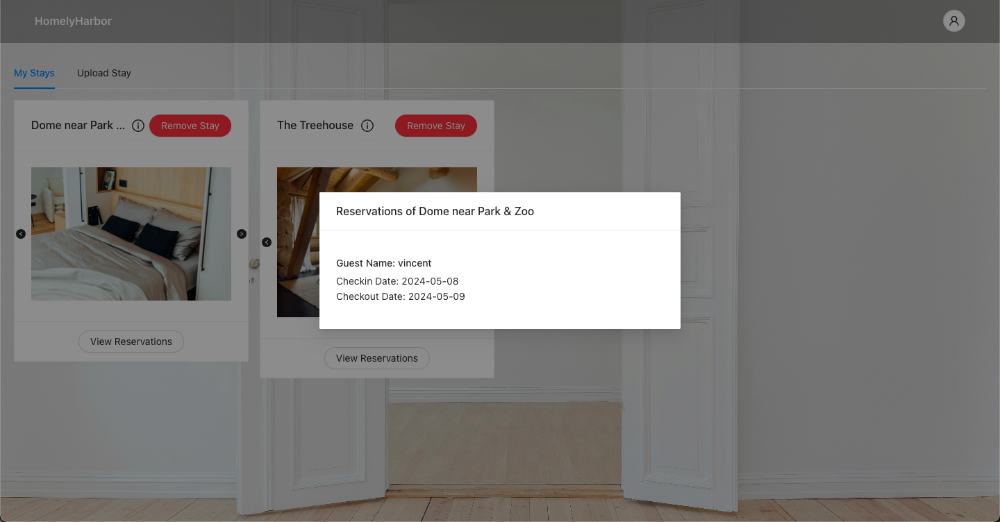
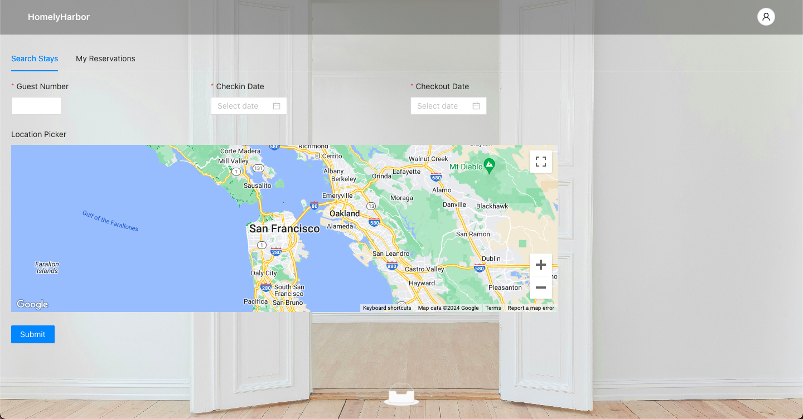
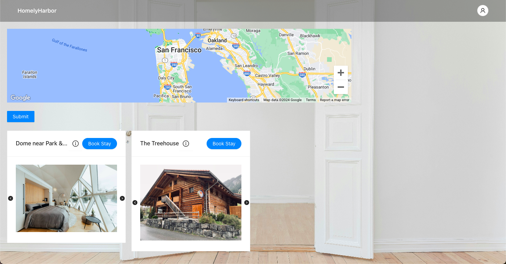

# HomelyHarbor
## _An online web platform for user with different roles (host or guest) to either uploading stay or reservating stays_

Welcome to the frontend repository of the HomelyHarbor. The backend code can be found [here](https://github.com/lan234234/HomelyHarbor-Web-Application-Backend/tree/master).

Visit us at: [HomelyHarbor](https://staging.d12b4crili04f4.amplifyapp.com)

## Features
- **Authentication:** Secure user profiles with registration, login, and logout functionalities.
- **Upload Hotel:** Hosts can upload new hotel listings complete with images and descriptions.
- **Manage Hotel:** Hosts can view their listed hotels and delete any existing entries.
- **Search Hotel:** Guests can search for available hotels with constraints on dates, location, and number of guests.
- **Manage Reservation:** Guests can view their reservation history and manage (add or delete) reservations.

## Demo
Explore screenshots from HomelyHarbor showcasing each of our core features:

### Authentication
#### Register and Login with Different Role

#### Logout

### Upload Hotel

*Interface for hosts to upload new hotels with details and pictures.*

### Manage Hotel
#### View and Delete Hosting Hotels

#### View Hotel Reservations

### Search Hotel

*Interface for clients to search for available hotels.*

#### Search Results

#### View Details

### Manage Reservation
#### Reserve Hotel

#### View and Delete Reserved Hotel

## Technologies Used

### Backend
- **Spring Boot:** Framework for building scalable, production-ready Java applications with ease, providing a suite of features like dependency injection, data access, and web APIs.
- **Java:** Primary programming language for backend development, chosen for its robustness, portability, and ecosystem.
- **MySQL:** Relational database management system for efficiently storing and managing user and application data.
  
### Frontend
- **HTML, CSS, JavaScript:** Core technologies for building and styling web frontends, providing structure, design, and interactivity.
- **React:** Popular JavaScript library for building fast, dynamic, and component-based user interfaces.
- **Node.js:** JavaScript runtime environment for developing scalable and high-performance network applications.
- **Ant Design:** Comprehensive design framework for creating beautiful and responsive UI components.

### Cloud Infrastructure
- **AWS RDS (Amazon Relational Database Service):** Managed relational database service used for MySQL deployment, providing scalability and reliability.
- **AWS Amplify:** Managed static hosting and full-stack deployment service for web applications, offering scalability, custom domains.
- **Google Cloud Storage:** Object storage solution for securely and efficiently storing application assets and backups.
- **Google Compute Engine:** Infrastructure-as-a-Service (IaaS) providing scalable virtual machines for running our applications.
- **Google App Engine:** Platform-as-a-Service (PaaS) offering for deploying and scaling web applications with ease.

### APIs & Geospatial Services
- **Google Geocoding API:** Service that provides geospatial data, enabling address-to-coordinates and coordinates-to-address conversions.
- **Google Maps JavaScript API:** API for embedding fully interactive maps into web applications, providing features like markers, layers, and geolocation.
- **GeoIndex:** Tool for indexing and querying geospatial data, enhancing our application's ability to handle location-based searches.

### Search & Security
- **Elasticsearch:** Distributed search engine enabling fast and efficient data retrieval, offering full-text search and analytics capabilities.
- **Token-based Authentication:** Secure method for managing user sessions and protecting user data via stateless authentication tokens.

## License
MIT License
